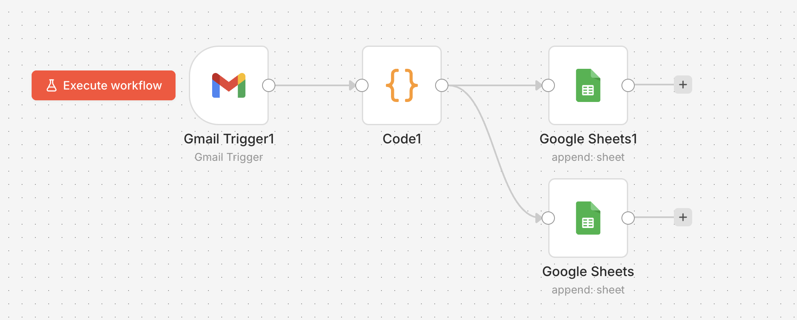

# N8N Shopee & MyShip Order Automation (N8N Shopee & 賣貨便 訂單自動化整合專案)

This project automates the extraction of e-commerce order data from emails and converts them into factory-ready shipping orders.
本專案自動化提取電商郵件訂單數據，並將其轉換為工廠端的出貨單資訊。

---

## 🔄 System Pipeline / 系統流程圖


## 🚀 Project Overview / 專案簡介

**English:**
An **E-commerce Order Automation System** designed to streamline post-purchase workflows. The system leverages **n8n** to monitor order confirmation emails from **Shopee** and **7-11 MyShip**. Using custom **JavaScript web-crawling logic**, it parses complex HTML content to extract critical data (Order ID, Items, Qty, Price) and automatically syncs it to **Google Sheets**, transforming raw notifications into actionable "Factory Shipping Orders."

**中文：**
本專案開發了一套「電商訂單自動化處理系統」，整合 **Shopee (蝦皮)** 與 **賣貨便 (MyShip)** 的售後流程。系統透過 n8n 自動監控訂單郵件，利用自定義的 **JavaScript 網頁爬蟲邏輯** 精準解析 HTML 內容，提取訂單編號、商品名稱、數量及金額等資訊，並自動寫入 **Google Sheets**，將原始資訊轉換為工廠端直接使用的「出貨通知單」。

---

## 🌟 Features / 功能特點

* **Automated Email Fetching**: Connects to IMAP/Gmail to monitor order notifications.
    (自動化郵件抓取：連結 IMAP/Gmail 監控訂單通知。)
* **JS Web-Crawler Logic**: Advanced JavaScript nodes to parse HTML templates and extract structured data.
    (JS 爬蟲邏輯：使用 JavaScript 節點解析 HTML 樣板，提取結構化數據。)
* **Google Sheets Integration**: Automatically generates shipping orders for factory fulfillment.
    (Google Sheets 整合：自動產生工廠出貨用訂單，實現無縫對接。)
* **Containerized Architecture**: Deployed via Docker Compose with dedicated Volumes for 1-click recovery.
    (容器化架構：透過 Docker Compose 部署，並搭配專屬 Volume 實現一鍵式復原。)

---

## 📂 Project Structure / 專案結構

* **`docker-compose.yml`**: Defines n8n container configurations and volume mounting.
* **`.venv/`**: Python virtual environment for auxiliary data analysis scripts.
* **`README.md`**: Operations and recovery manual.

---

## 🛠️ Quick Start / 快速啟動

### 1. Start Service / 啟動服務
If this is your first time running the project or if the container was deleted, execute:
如果你是第一次在此目錄執行，或是不小心刪除了容器，請執行：
```bash
docker-compose up -d
```

### 2. Check Logs / 查看日誌
To debug JavaScript nodes or monitor processing status:
監控即時訂單處理狀況或進行除錯：

```bash
docker logs -f n8n_shopee_myship
```